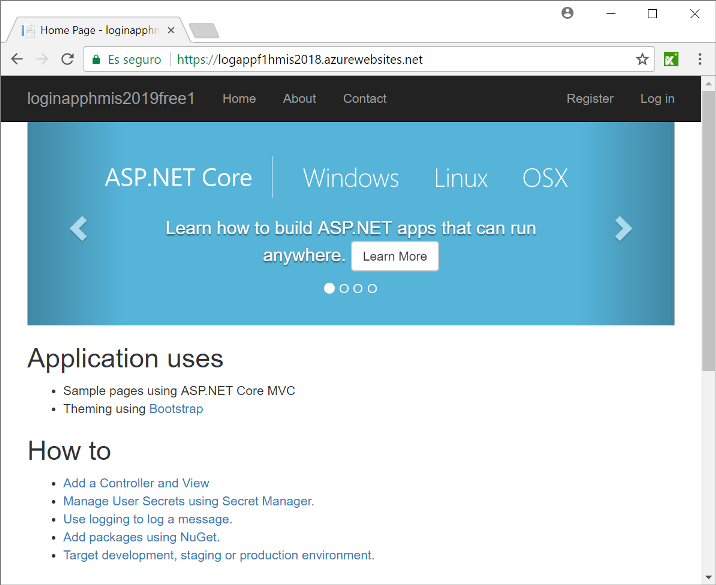

# Ejemplo con Selenium IDE
[](https://github.com/ualhmis/seleniumLoginClase/issues)
1. Realizar un fork de este repositorio en un repositorio en su cuenta GitHub personal. Tras ello, convierta el repositorio en privado siguiendo los pasos mismos pasos descritos en el ejercicio 6 de la actividad05. . Para ello: 
  * cree un nuevo repositorio privado en GitHub
  * con Git Bash, cree un clon "bare" del repositorio forkeado
```bash
git clone --bare https://github.com/exampleuser/forked-repository.git
```
  * Mirror-push al nuevo repositorio.
```bash
cd forked-repository.git
git push --mirror git@github.com:exampleuser/new-repository.git
```
  *  Elimine el repositorio local creado en el paso anterior
```bash
cd ..
rm -rf forked-repository.git
```
  * Ya puede trabajar normalmente con el nuevo repositorio privado. 


2. Cargar la Test Suite con Katalon Recorder
    * Requisitos: Tener instalado el plugin  Katalon Recorder (explicado aquí: https://github.com/ualhmis/seleniumIDEejemploClase)
    * Cargar el test suite: _LoginHmis2018dotNetfree.html_ (version actualizada en inglés de la app _login_.)
  
3. Lanzar los tests (sobre https://logappf1hmis2018.azurewebsites.net/) (Actualizado 2018)



4. Añadir los tests necesarios para probar toda la funcionalidad de la aplicación: 
  * Registro de usuario (Caso correcto - hecho)
  * Registro de usuario (Casos incorrectos - por hacer)
  * Login de usuario (Caso correcto - hecho)
  * Login de usuario (Casos incorrectos - por hacer)
  * Editar el perfil de usuario (caso correcto - por hacer)
  * Editar el perfil de usuario (casos incorrectos - por hacer)
  * Cambio de contraseña de usuario (Caso correcto - por hacer)
  * Cambio de contraseña de usuario (Casos incorrectos - por hacer)
	
	
5. No olvide invitar al profesor para que pueda leer su repositorio privado (username ualjjcanada)